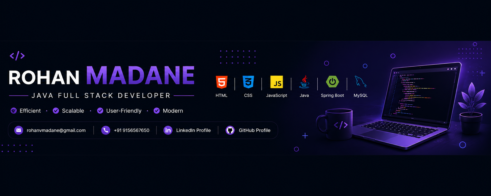

# 🚀 Rohan Madane - Personal Portfolio Website



A modern, fully responsive **Personal Portfolio Website** built using **HTML, CSS, and JavaScript** to showcase my skills, projects, internships, and contact information.

🔗 **Live Demo:** https://madanerohan.github.io/MyPortfolio/

🔗 **GitHub Repository:** https://github.com/MadaneRohan/MyPortfolio

---

# 📌 Features

- 🌙 Dark / Light Theme Toggle
- 📱 Fully Responsive Design
- ⚡ Smooth Scrolling Navigation
- 👨‍💻 Professional Hero Section
- 🙋 About Me Section
- 💻 Technical Skills
- 🎓 Internship Experience
- 📂 Project Showcase
- 📞 Contact Form
- 📄 Resume Download Button
- 🔗 GitHub & LinkedIn Integration
- ✨ Modern UI/UX Design

---

# 🖼️ Website Preview

## Home Page


---

## About & Skills


---

## Internship Section


---

## Projects Section


---

## Contact Section


---

## Footer


---

# 🛠️ Built With

- HTML5
- CSS3
- JavaScript (ES6)
- Font Awesome
- Google Fonts

---

# 📂 Project Structure

```
MyPortfolio/
│
├── cv/
├── images/
├── screenshots/
├── index.html
├── style.css
├── script.js
├── README.md
└── LICENSE
```

---

# 📁 Portfolio Sections

### 🏠 Home

Professional landing page with:

- Introduction
- Social Links
- Resume Download
- Theme Toggle

---

### 👨 About

- Personal Introduction
- Career Objective
- Java Full Stack Developer
- Problem Solver
- Fresher

---

### 💻 Skills

- HTML
- CSS
- JavaScript
- Java
- OOP
- SQL
- JDBC
- Servlets
- JSP
- Thymeleaf
- Spring
- Spring Boot
- REST APIs
- Maven
- GitHub

---

### 🎓 Internship

### Java Developer Intern – CodSoft

Worked on Java programming assignments focusing on

- Core Java
- Object Oriented Programming
- Collections
- File Handling
- Exception Handling
- Algorithm Design
- Clean Code Practices

---

### 📂 Projects

## 1️⃣ Personal Portfolio Website

A modern responsive portfolio website built using HTML, CSS, and JavaScript.

### Features

- Responsive Design
- Dark Mode
- Resume Download
- Smooth Animation
- Contact Section

---

## 2️⃣ Online Voting System

A complete Online Voting Web Application developed using

- Java
- Spring Boot
- Spring MVC
- Thymeleaf
- MySQL
- HTML
- CSS
- JavaScript

### Features

- User Registration
- User Login
- Admin Login
- Cast Vote
- Already Voted Check
- Live Vote Counting
- Admin Dashboard
- Responsive UI

GitHub:
https://github.com/MadaneRohan/OnlingVotingApp

---

### 📞 Contact

- Email - rohanvmadane@gmail.com
- Phone - +919156567650
- LinkedIn - https://www.linkedin.com/in/rohan-madane-6b06bb286
- GitHub - https://github.com/MadaneRohan

---

# 🚀 Getting Started

Clone the repository

```bash
git clone https://github.com/RohanProjects2025/MyPortfolio.git
```

Open the project

```bash
cd MyPortfolio
```

Open

```
index.html
```

in your browser.

---

# 📈 Future Improvements

- React Version
- Contact Form Backend
- Blog Section
- Project Filtering
- Animations using GSAP
- More Projects
- Certifications Section

---

# 👨‍💻 Author

## Rohan Madane

Java Full Stack Developer

📧 rohanvmadane@gmail.com

💼 [LinkedIn](https://www.linkedin.com/in/rohan-madane-6b06bb286)

🐙 [GitHub](https://github.com/MadaneRohan/MyPortfolio)

[Portfolio](https://madanerohan.github.io/MyPortfolio/)

---

# ⭐ If you like this project

Please consider giving this repository a ⭐ on GitHub.

It motivates me to build more projects.

---

# 📄 License

This project is open source and available under the MIT License.
